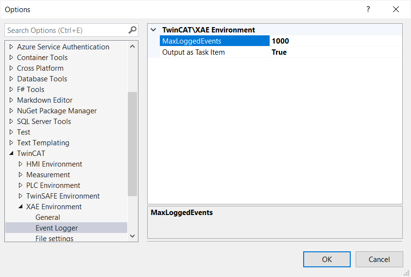
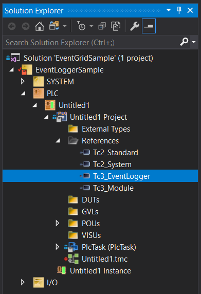
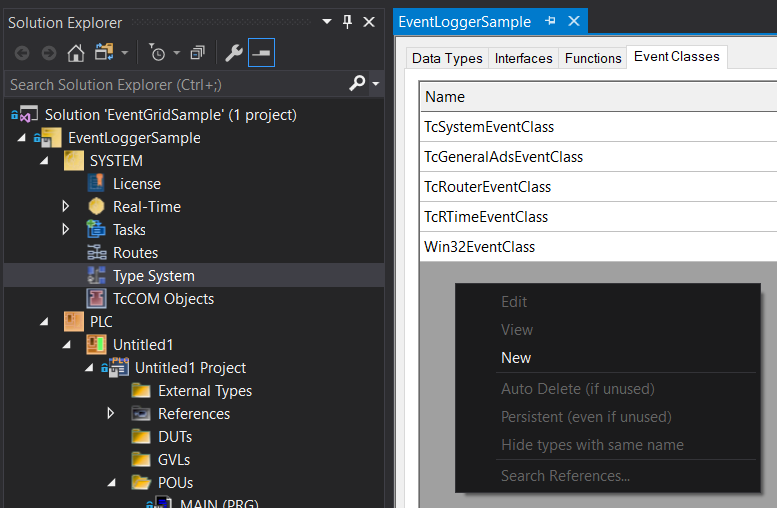
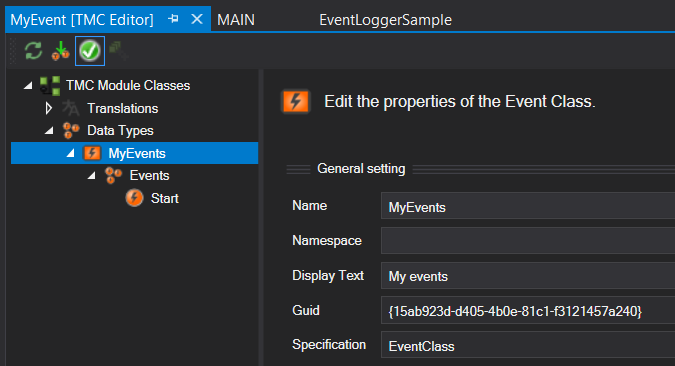
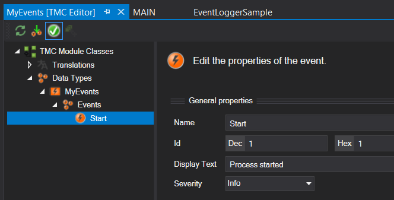
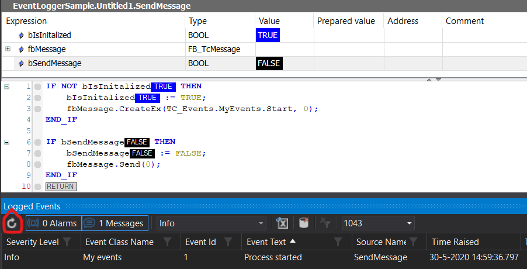
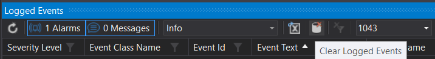
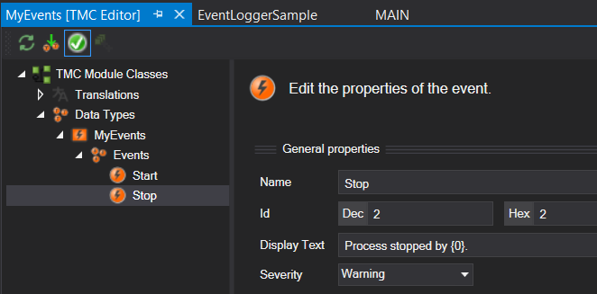
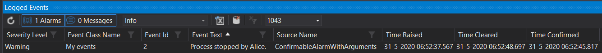
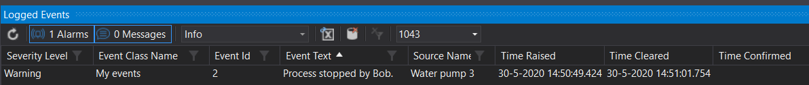

# TwinCAT EventLogger: PLC part

Keeping track of all the things which are happening on your machine can be a daunting task. Whether it’s expected events or unexpected warnings and errors of which you want to inform the user. Luckily Beckhoff provides us with a tool which can help with that, namely the EventLogger. In this article I will introduce the PLC part of the EventLogger and show some useful features (code: [PlcPart](PlcPart/)). A second article will show how to visualize the events using TwinCAT’s web-based HMI (TE2000) (code: [HmiPart](HmiPart/)). 

Thanks to [Jakob Sagatowski ](https://github.com/sagatowski) for his valuable feedback while writing this article.

Events are created on the PLC and are organized in EventClasses, as shown in the image below. The events themselves can be of two different types. First there is the stateless message type which can only be sent. Second there is the alarm which also has a state. The states of the alarms work as follows. There are two mutually exclusive states: raised and cleared and an optional third state: confirmed which is independent of the first two. The raised and cleared state are used to indicate if an alarm condition is fulfilled (e.g. a temperature is above a certain limit). The optional confirmation state can be used to indicate that the user has seen the alarm and is aware of it. Finally all raised alarms are automatically cleared when the PLC is restarted, but they are not automatically confirmed.


A limited number of past events are cached in a local database file on the harddrive in `C:\TwinCAT\3.1\Boot\LoggedEvents.db`. The maximum number of logged events is set to 1000 by default and can be changed under **Tools > Options > TwinCAT XAE Environment > EventLogger**, as shown below. This database is not cleared when you restart the PLC, so you can view past events. For more details on the EventLogger there is an extensive [manual](https://download.beckhoff.com/download/Document/automation/twincat3/TC3_EventLogger_EN.pdf) available and InfoSys has a few [tutorials and examples](https://infosys.beckhoff.com/content/1033/tc3_eventlogger/27021602043327883.html?id=2784076848234793699). 



Now we know a little about the theory behind events, let's look at an example. You can download the example project from the [PlcPart](https://github.com/Roald87/TwinCatEventLoggerExample/tree/master/PlcPart) folder. I’ve created a standard TwinCAT XAE project with a standard PLC project. I then added the **Tc3_EventLogger** library under **References** as shown in the image below. This library contains all the function blocks we need for the events.



Before we start sending messages and raising events we’ll create a new [EventClass](https://infosys.beckhoff.com/content/1033/tc3_eventlogger/9007204107498251.html?id=4886737213905623273). In an event class, a number of related events can be organized. Of course you can also use the standard TwinCAT events (e.g. TcSystemEventClass as shown below), but those are probably not so relevant for the end user. You can add a new EventClass by going to **SYSTEM > Type System** and then select the tab **Event Classes**, as shown below. Then right click on the empty field to create a new event class.



A TMC editor window should open. I named the EventClass *MyEvents* and set the display text to *My events*. The name can’t contain spaces and will be used in the event declaration as we will see in a minute. The display text is one of the things which can be shown to the user and can be a general description of the EventClass.



Then I renamed the first default [event](https://infosys.beckhoff.com/content/1033/tc3_eventlogger/4852759179.html?id=7440132292714549021) to *Start* and added *Process started* under **Display Text**. Finally I gave this event the severity Info, because it will be used for a message.



We can then start adding to code to send this message. For that we create a program `SendMessage`. In the program declaration we make an instance of [`FB_TcMessage`](https://infosys.beckhoff.com/content/1033/tc3_eventlogger/18014403512523147.html?id=2612337694701808037). This function block will contain all the information regarding our message event. 

```
PROGRAM SendMessage
VAR
	bIsInitalized : BOOL;  
	fbMessage : FB_TcMessage;
	bSendMessage : BOOL;
END_VAR
```

Before we can use it, we have to initialize it as shown below. This is done by calling the [`CreateEx`](https://infosys.beckhoff.com/content/1033/tc3_eventlogger/5050947211.html?id=4556597922729890829) method. This method takes two arguments for a message event. The first argument, `TC_Events.MyEvents.Start`, is the event we created earlier in our custom event class. The second argument is where you can enter a [source](https://infosys.beckhoff.com/content/1033/tc3_eventlogger/5057918859.html?id=806507598712086760) of the event. An example for a source could be if the message belongs to a certain component in your machine, then you can give it a specific name. I’ll show an example on this at the end of this post. For now we set it at 0, which will give it a default source name. By default the source name is the program+function block path to the event. So for this event the source name is `SendMessage`. 

```
IF NOT bIsInitalized THEN
	bIsInitalized := TRUE;
	fbMessage.CreateEx(TC_Events.MyEvents.Start, 0);
END_IF
```

Finally in order to send the message we call the [`Send`](https://infosys.beckhoff.com/content/1033/tc3_eventlogger/5051076107.html?id=4895394468327295574) method. The send method takes one argument which is the timestamp of the message. If you set it to 0, it takes the current time and if it is larger than 0 it takes the time in 100 nanoseconds since January 1st, 1601 (UTC).

```
IF bSendMessage THEN
	bSendMessage := FALSE;
	fbMessage.Send(0);
END_IF
```

The complete code is then as follows:

```
PROGRAM SendMessage
VAR
    bIsInitalized : BOOL;    
    fbMessage : FB_TcMessage;
    bSendMessage : BOOL;
END_VAR

IF NOT bIsInitalized THEN
    bIsInitalized := TRUE;
    fbMessage.CreateEx(TC_Events.MyEvents.Start, 0);
END_IF

IF bSendMessage THEN
	bSendMessage := FALSE;
    fbMessage.Send(0);
END_IF
```

Now we can activate our configuration. In order to see our events we need to activate the [Logged Events window](https://infosys.beckhoff.com/content/1033/tc3_eventlogger/27021602616987915.html?id=2970470299138771131) which can be found under **View > Other Windows > TwinCAT Logged Events**. This logger shows up to 1000 (as set earlier) past events. Now log into the PLC. You should see something which looks like the image below. If you set `bMessage` to `TRUE` a message should be sent to the event logger. In order to see it in the Logged Events window, refresh the logger using the refresh button on the bottom left in the image. The logger nicely shows an overview of the different parameters of the class name the event is part of, info of the event itself and the time it was sent. 



 From the logged events window it is also possible to remove past events from the database using the button on the right, as shown below. As far as I know, this is the only way to remove old events from the database.



Now let’s add some more code so we can also see the behavior of alarms. First I add a new event to the event class. I give it the name Stop with the severity Warning. For the display text I also added an [argument](https://infosys.beckhoff.com/content/1033/tc3_eventlogger/9007204312656907.html?id=2181748310896520024) `{0}`. Later we can use this to add a custom text to the display text.



In order to use this alarm we’ll create a new program `ConfirmableAlarmWithArguments`. First we make an instance, `fbAlarm`, of the [`FB_TcAlarm`](https://infosys.beckhoff.com/content/1033/tc3_eventlogger/18014403511408907.html?id=8336441833469907165) function block in the program declaration. 

```` 
PROGRAM ConfirmableAlarmWithArguments
VAR
    bIsInitalized : BOOL;    

    fbAlarm : FB_TcAlarm;
    bRaiseAlarm : BOOL;
    bClearAlarm : BOOL;
    bConfirmAlarm : BOOL;
END_VAR
````

Then we initialize the alarm using the [`CreateEx`](https://infosys.beckhoff.com/content/1033/tc3_eventlogger/5050478347.html?id=410353039931221768) method. The first argument this method takes is the same as for the message: it is the event we created earlier `TC_Events.MyEvents.Stop`. The second argument defines if this alarm should have the optional confirmation state, which I set to `TRUE` in this example. The third argument is the event source information, more on this later. 

```
IF NOT bIsInitalized THEN
    bIsInitalized := TRUE;
    fbAlarm.CreateEx(TC_Events.MyEvents.Stop, TRUE, 0);    
END_IF
```

Before we can raise the alarm we need to fill in the `{0}` argument. This is done in the line `fbAlarm.ipArguments.Clear().AddString('Alice')`, which utilizes a [fluent interface](https://www.plccoder.com/fluent-code/). The property [ipArguments](https://infosys.beckhoff.com/content/1033/tc3_eventlogger/5050737547.html?id=8678281429452015597) returns all the arguments present in the event text, which are then reset just to be sure with the [`Clear()`](https://infosys.beckhoff.com/content/1033/tc3_eventlogger/5051357707.html?id=704794183241270963) method. With the final method [`AddString()`](https://infosys.beckhoff.com/content/1033/tc3_eventlogger/9007204306000139.html?id=6228960240777617204) we add our custom string to the, first and only, argument in the event text. You can then raise the alarm with the [`Raise()`](https://infosys.beckhoff.com/content/1033/tc3_eventlogger/5050505739.html?id=8432917619912920197) method, which takes a single argument. This argument is the time, which we set to `0` to take the current time.

```
IF bRaiseAlarm THEN
    bRaiseAlarm := FALSE;
    fbAlarm.ipArguments.Clear().AddString('Alice');
    fbAlarm.Raise(0);
END_IF
```

In order to confirm an alarm, we add the following code. Here the [`Confirm()`](https://infosys.beckhoff.com/content/1033/tc3_eventlogger/5050451339.html?id=3569329908820721746) method takes a single argument, which is the time of confirmation. When set to `0` it takes the current time.

```
IF bConfirmAlarm THEN
    bConfirmAlarm := FALSE;
    fbAlarm.Confirm(0);
END_IF
```

Finally we add the following lines to clear an alarm. The [`Clear()`](https://infosys.beckhoff.com/content/1033/tc3_eventlogger/5050438027.html?id=8213494572379476886) method takes two arguments, the first one is the time again which we set to the current time with `0`. The second argument determines if this alarm should be confirmable after it has been cleared. Or in Beckhoff’s language: if the alarm’s confirmation state should be reset. By setting the argument to `FALSE` the confirmation state is not reset. So you can confirm it after it has been cleared. When it is set to `TRUE`, the confirmation state is reset and you can’t confirm it once it has been cleared.

```
IF bClearAlarm THEN
    bClearAlarm := FALSE;
    fbAlarm.Clear(0, FALSE);
END_IF
```

So our complete code then looks like this:

```
PROGRAM ConfirmableAlarmWithArguments
VAR
    bIsInitalized : BOOL;    

    fbAlarm : FB_TcAlarm;
    bRaiseAlarm : BOOL;
    bClearAlarm : BOOL;
    bConfirmAlarm : BOOL;
END_VAR

IF NOT bIsInitalized THEN
    bIsInitalized := TRUE;
    fbAlarm.CreateEx(TC_Events.MyEvents.Stop, TRUE, 0);    
END_IF

IF bRaiseAlarm THEN
    bRaiseAlarm := FALSE;
    fbAlarm.ipArguments.Clear().AddString('Alice');
    fbAlarm.Raise(0);
END_IF

IF bConfirmAlarm THEN
    bConfirmAlarm := FALSE;
    fbAlarm.Confirm(0);
END_IF

IF bClearAlarm THEN
    bClearAlarm := FALSE;
    fbAlarm.Clear(0, FALSE);
END_IF
```

After activating the configuration you can raise, confirm and clear or clear and confirm the alarm and view the state and times in the Logged events window. You should see something as below. Note that the event text displays the name of the operator who stopped the process.



```
PROGRAM AlarmWithCustomSourceInfo
VAR
    bIsInitalized : BOOL;    
    fbAlarm : FB_TcAlarm;
    bRaiseAlarm : BOOL;
    bClearAlarm : BOOL;
    fbSourceInfo : FB_TcSourceInfo;
END_VAR
```

We can then initialize `fbSourceInfo` with the source name, as shown below. First we call the [`Clear()`](https://infosys.beckhoff.com/content/1033/tc3_eventlogger/5050985483.html?id=2752512302477066048) method on `fbSourceInfo` to reset the source information. Then we add our custom name with `fbSourceInfo.sName := 'Water pump 3'`. Finally we create a new alarm, where we pass our custom `fbSourceInfo` as an argument: `fbAlarm.CreateEx(TC_Events.MyEvents.Stop, FALSE, fbSourceInfo)`. Note that this alarm is created as a non-confirmable alarm, since the second argument is false.

```
IF NOT bIsInitalized THEN
    bIsInitalized := TRUE;    
    fbSourceInfo.Clear();
    fbSourceInfo.sName := 'Water pump 3';
    fbAlarm.CreateEx(TC_Events.MyEvents.Stop, FALSE, fbSourceInfo);
END_IF
```

The part to raise the event is the same as the previous example, only I added another name.

```
IF bRaiseAlarm THEN
    bRaiseAlarm := FALSE;
    fbAlarm.ipArguments.Clear().AddString('Bob');
    fbAlarm.Raise(0);
END_IF
```

Also the clear alarm part is the same. However, because this alarm doesn’t have a confirmation state, the second argument in the  `Clear()` method doesn’t have any influence. 

```
IF bClearAlarm THEN
    bClearAlarm := FALSE;
    fbAlarm.Clear(0, TRUE);
END_IF
```

The complete code is as follows:

```
PROGRAM AlarmWithCustomSourceInfo
VAR
    bIsInitalized : BOOL;    
    fbAlarm : FB_TcAlarm;
    bRaiseAlarm : BOOL;
    bClearAlarm : BOOL;
    fbSourceInfo : FB_TcSourceInfo;
END_VAR

IF NOT bIsInitalized THEN
    bIsInitalized := TRUE;    
    fbSourceInfo.Clear();
    fbSourceInfo.sName := 'Water pump 3';
    fbAlarm.CreateEx(TC_Events.MyEvents.Stop, FALSE, fbSourceInfo);
END_IF

IF bRaiseAlarm THEN
    bRaiseAlarm := FALSE;
    fbAlarm.ipArguments.Clear().AddString('Bob');
    fbAlarm.Raise(0);
END_IF

IF bClearAlarm THEN
    bClearAlarm := FALSE;
    fbAlarm.Clear(0, TRUE);
END_IF
```

If we then activate our configuration again and raise and clear the alarm with our custom source information it should look like the image below. Under source name you now see the name we defined earlier with `fbSourceInfo.sName` instead of the program name.



I hope you learned something new today! In a future post I’ll show how to visualize the events in the TwinCAT’s web-based HMI (TE2000).
